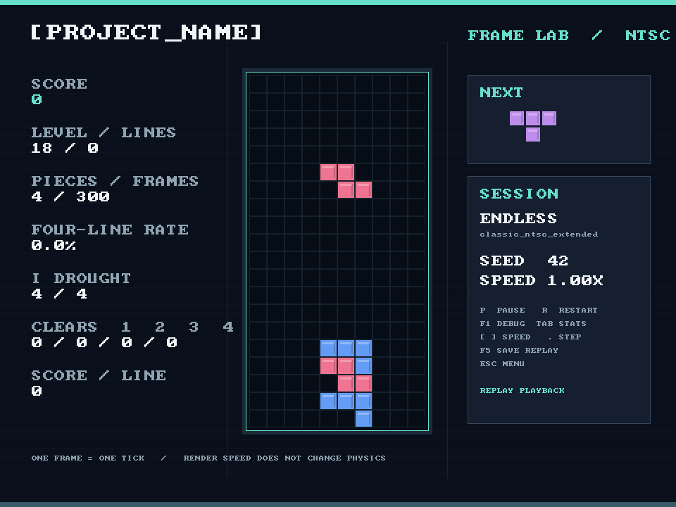

# Block Stack

A falling-block game and deterministic AI environment inspired by the gameplay of 1989 NES Tetris.

I started this project mainly to train and test an AI that can play with NES-style button inputs, one game frame at a time. The simulation runs without a display, gives reproducible results from a seed, and can be stepped as fast as the CPU allows. I also added a playable desktop client and a few quality-of-life tools for practice and debugging.



## What's included

- **One shared C++ simulation:** the desktop game, headless tools, Python API, and tests all use the same frame-based rules.
- **AI tools:** frame-level actions, board and timing observations, deterministic seeds, cloning, save states, batch environments, and an optional Gymnasium wrapper.
- **Practice tools:** replay recording and playback, frame advance, speed controls, a debug overlay, and extra statistics such as four-line rate and I-piece drought.
- **Desktop conveniences:** keyboard and gamepad controls, rebinding, fullscreen, high contrast, persistent settings, and original visuals and sound effects.
- **Two NTSC presets:** `classic_ntsc_strict` keeps closer numerical limits; the default `classic_ntsc_extended` keeps the same controls and timing with an uncapped score and safe high-level play.

This repository provides the environment and interfaces for training an agent; it does not include a trained AI player.

## Build and play

You need a C++20 compiler, CMake 3.20+, and SDL3 development files (`libsdl3-dev` on Ubuntu).

```sh
cmake -S . -B build
cmake --build build -j
ctest --test-dir build --output-on-failure
./build/project_name
```

The [controls guide](docs/controls.md) covers the desktop keys, controller buttons, and settings.

## Run headlessly

```sh
cmake -S . -B build-headless -DPROJECT_BUILD_APP=OFF
cmake --build build-headless -j
./build-headless/project_name_headless --level 18 --seed 42 --frames 100000 --final-hash
```

Headless runs do not create a window or sleep between frames. `--input-file` accepts one controller bitmask byte per frame. For Python, build with `PROJECT_BUILD_PYTHON=ON` (the default) and run:

```sh
PYTHONPATH=python BLOCKS_NATIVE_LIB="$PWD/build-headless/libblocks_native.so" python3 python/examples/headless.py
```

For Gymnasium, install `numpy` and `gymnasium`, then see [the Gym example](python/examples/gym_agent.py) and [AI API guide](docs/ai-api.md). Replays, state snapshots, trace comparison, and benchmarks are described in the [replay guide](docs/replay-format.md) and [benchmark notes](docs/benchmark.md).

## Compatibility and legal note

The goal is to reproduce classic NES gameplay behavior, not its presentation. The Classic presets do not add hold, hard drop, or wall kicks. Some rare original-game quirks are still approximated; the [compatibility table](docs/compatibility.md) records the evidence and limits.

All graphics and sound effects here are original. No ROM, Nintendo graphics, music, or sound effects are included. This is an independent project with no Nintendo or Tetris affiliation. The code is [MIT licensed](LICENSE).
